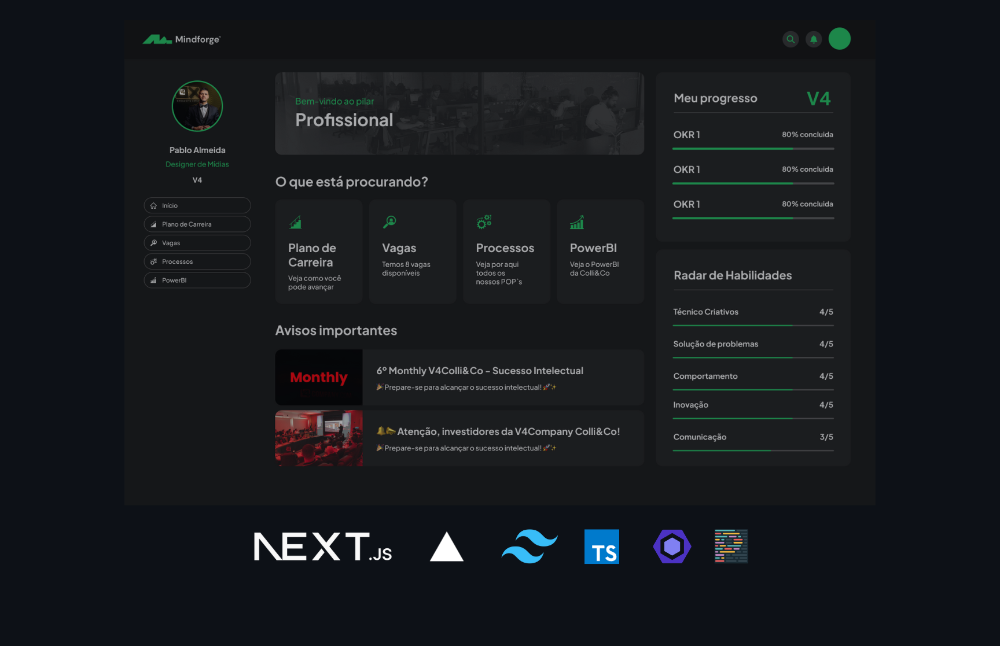

<h3 align= "center" fontSize="60px">
  Projeto Mindforge
</h3>

<p align="center">
    
</p>

## :rocket: Tecnologias
-  Next.js 14
-  Typescript
-  @tremor/react
-  @headlessui
-  Tailwind.css
-  Vercel Analytics

## 💻 Sobre o projeto

Este projeto é um front-end de um dashboard desenvolvido para o teste técnico da V4 Company. O layout foi construído em forma de componentes para melhor organização e reutilização do código. Além disso, o modo responsivo foi implementado para garantir uma boa experiência do usuário em diferentes tamanhos de tela.

### Funcionalidades

- [x] **Efeito Menu**: Desenvolvi um efeito dinâmico no background do menu que se adapta ao scroll do usuário.
- [x] **Menu e listas**: Projetei uma lista intuitiva de botões para o menu do aplicativo.
- [x] **Saldo em conta**: Integrei a visualização do saldo em conta do cliente diretamente no dashboard.
- [x] **Listagem Carrossel**: Adicionei botões de controle para uma manipulação mais eficiente da visualização dos itens da sessão.
- [x] **SVGs como ícones**: Converti SVGs em componentes de ícones para facilitar a manutenção e melhorar a consistência visual.
- [x] **Sidebar com lógica de navegação**: Implementei uma Sidebar com uma lógica de navegação eficiente e intuitiva.
- [x] **Layout Responsivo**: Desenvolvi um layout responsivo que se adapta a diferentes tamanhos de tela, garantindo uma experiência do usuário otimizada.
- [x] **Componentização do Layout**: Organizei o layout em componentes reutilizáveis para melhorar a organização e a manutenção do código.

## :computer_mouse: Instalação e execução

Faça um clone desse repositório e acesse o diretório.

```bash
$ git clone git@github.com:afonsoburginski/frontend-test.git && cd frontend-test
```

```bash
# Instalando as dependências
$ yarn install

# Executanto aplicação
$ yarn run dev
```

## :speech_balloon: Autor
-  [Github](https://github.com/afonsoburginski/)
-  [Linkedin](https://www.linkedin.com/in/afonsoburginski/)
-  [Email](mailto:afonsoburginski@gmail.com/)

## 📝 Licença

Esse projeto está sob a licença MIT. Veja o arquivo [LICENSE](LICENSE.md) para mais detalhes.
